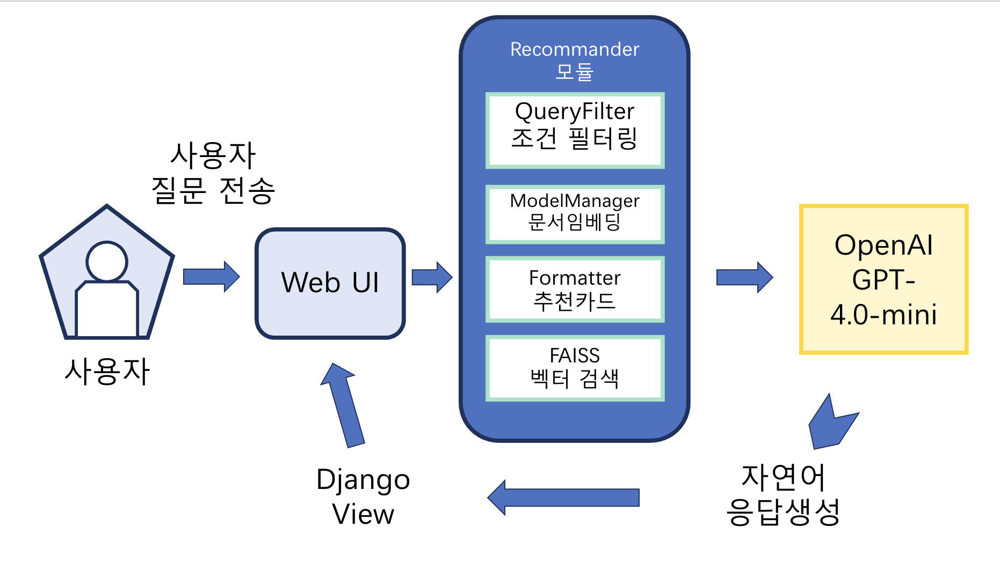
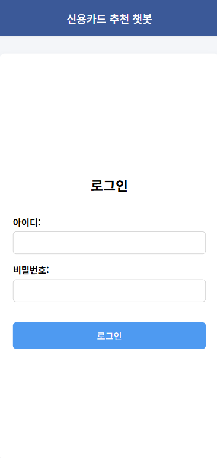
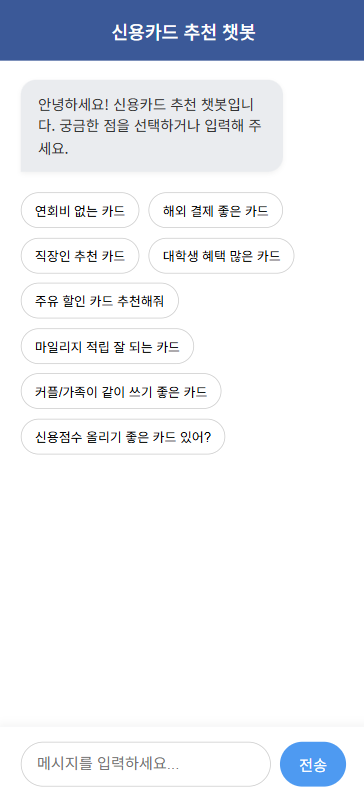
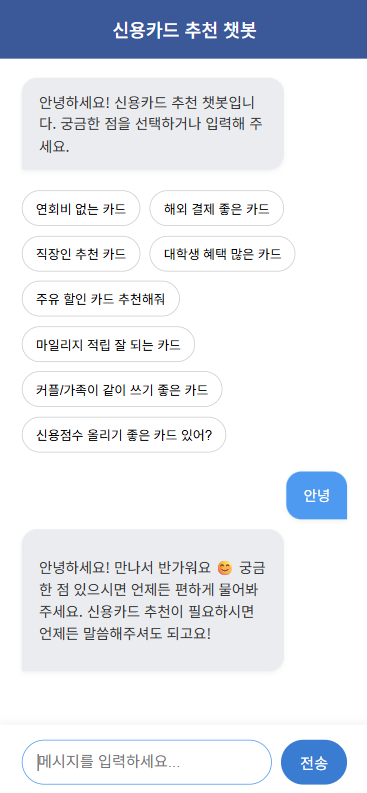
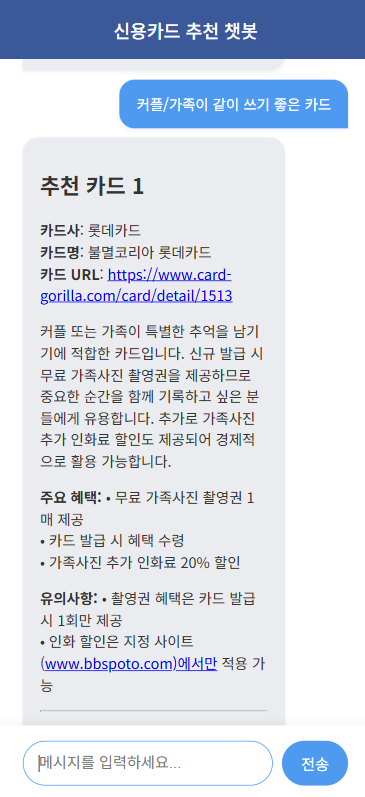

# 💳 신용카드 추천 챗봇 (LLM 기반 RAG 시스템)

## 🧑‍💻 팀원 소개
<table align=center>
  <tbody>
   <tr>
      <td align=center><b>최성장</b></td>
      <td align=center><b>고범석</b></td>
      <td align=center><b>김동욱</b></td>
      <td align=center><b>안수민</b></td>
      <td align=center><b>지형우</b></td>
    </tr>
    <tr>
      <td align="center">
          
      </td>
      <td align="center">
          
      </td>
      <td align="center">
          
      </td>
      <td align="center">
        
      </td>
      <td align="center">
        
      </td>
    </tr>
    <tr>
        <td align="center">
       <a href="https://github.com/GrowingChoi">
         
       </a>
       </td>
       <td align="center">
       <a href="https://github.com/qjazk0000">
         
       </a>
       </td>
       <td align="center">
       <a href="https://github.com/boogiewooki02">
         
       </a>
       <td align="center">
       <a href="https://github.com/tnalsdk111">
         
       </a>
       </td>
       </td>
       <td align="center">
       <a href="https://github.com/JI0617">
         
       </a>
       </td>
    </tr>
  </tbody>
</table>
<br>
<br/><br/>

## 프로젝트 개요

사용자의 소비 성향과 원하는 혜택에 따라 최적의 신용카드를 추천하는 RAG 기반 AI 챗봇입니다.  
질문 한 줄만으로 방대한 카드 혜택 정보를 요약하고 비교해, 빠르고 정확한 카드 선택을 돕습니다.

### 프로젝트 필요성

수많은 카드사와 혜택이 혼재된 시장에서 소비자는 자신에게 맞는 카드를 찾기 어려운 상황입니다.  
공식 홈페이지나 블로그, 광고 정보는 분산되어 있어 객관적인 비교가 어렵고, 소비자 입장에서 실질적인 정보 접근성도 낮습니다.  
특히 특정 혜택(예: 주유, 해외 결제, 스트리밍 할인 등)을 중점적으로 비교하고자 할 때, 신뢰할 수 있는 정보 제공 시스템의 부재가 문제가 되고 있습니다.

이에 따라, 신용카드 혜택 정보를 통합 수집하고 사용자의 질문에 맞춰 맞춤형으로 추천해주는 AI 기반 챗봇의 필요성이 대두되고 있습니다.

### 프로젝트 목표

- 카드 혜택, 연회비, 발급 조건 등 다양한 정보를 통합적으로 제공하는 신용카드 추천 챗봇을 구축합니다.  
- RAG(Retrieval-Augmented Generation) 구조를 기반으로, 문서 검색과 LLM 응답 생성을 결합하여 사용자 질문에 정확한 답변을 제공합니다.  
- LangChain 기반 파이프라인을 통해 크롤링, 전처리, 벡터화, 검색, 응답 생성을 체계화하고, RAGAS 지표를 활용해 성능을 정량적으로 평가합니다.  
- 사용자 신뢰도 확보를 위해 카드 상세 페이지 링크와 혜택 출처 정보를 함께 제공합니다.  
- 누구나 쉽게 접근 가능한 웹 인터페이스와 챗봇 구조를 통해 카드 정보 탐색의 진입 장벽을 낮추고, 소비자 선택을 돕습니다.


---

## 2. 주제 선정 이유
### 신용카드 선택은 복잡하고 조건이 다양함

### 사용자마다 연회비, 혜택, 라이프스타일이 다름

### 기존 챗봇은 정해진 QnA만 제공 → 사용자의 세부 질문에는 대응이 불가능함

### 벡터 검색 + LLM 활용으로 해결 가능

### 카드 정보를 벡터로 임베딩하여 빠르게 필터링 가능

### 사용자의 질문을 이해하고, 맞춤형 응답 제공 가능

### FAQ, 카드 설명, 사용자 조건까지 통합 분석 가능

### 대화형 인터페이스로 카드 선택 UX 개선

### 사용자는 단순히 "해외 결제 좋은 카드 추천해줘"처럼 자연어로 물으면 됨

---

## 시스템 구조도


## 3. 주요 기능 요약
| 기능| 설명 |
|------|------|
| **🔐 사용자 인증** | 로그인 기능을 통해 접근 제어 |
| **💬 챗봇 UI** | `chat.html` 기반의 채팅 인터페이스 제공 |
| **🧠 LLM 기반 카드 추천** | 사용자 질문 분석 → 조건 필터링 → FAISS 검색 → 프롬프트 생성 → 답변 생성 |
| **🔎 유사 질문 FAQ 검색** | 유사한 FAQ 벡터 검색으로 빠른 응답 |
| **🧰 모듈화된 추천 파이프라인** | `formatter`, `prompt_builder`, `recommender` 등 역할 분리 구조 |
| **📦 FAISS 기반 벡터 검색** | 사전 벡터화된 카드 정보 인덱스에서 밀리초 단위 검색 수행 |
| **🧱 Django 기반 백엔드** | Django 앱 구조로 관리 및 확장 용이 |

---

## 4. 기술 스택
| 구분 | 사용 기술 |
|------|------|
| **Language** | Python |
| **Web Framework** | Django |
| **Embedding Model** | `sentence-transformers` |
| **Vector DB** | FAISS |
| **LLM Integration** | OpenAI GPT |
| **Frontend** | HTML + JavaScript |
| **기타** | `langchain`, `torch`, `dotenv` 등 |

## 5. 프로젝트 구조
```bash
chat_project/
├── accounts/                # 로그인 관련 기능
├── chatbot/                 # 챗봇 UI + API
├── recommendation/          # 추천 알고리즘 로직
│   ├── formatter.py
│   ├── model_manager.py
│   ├── prompt_builder.py
│   ├── query_filter.py
│   └── recommender.py
├── embedding/               # FAISS 기반 벡터 검색 로직
│   └── EmbeddingCardInfo.py
├── templates/
│   ├── base.html
│   ├── accounts/login.html
│   ├── accounts/home.html
│   └── chatbot/chat.html
├── chat_project/            # Django 설정
│   ├── settings.py
│   ├── urls.py
├── manage.py
└── requirements.txt
└── documents                # 산출물
```

---

## 6. 시스템 아키텍처 및 흐름
```bash
[사용자 질문] 
     ↓
[chat.html → GET /api/chat_message/ 호출]
     ↓
[chatbot.views → recommendation.recommender 호출]
     ↓
[사용자 조건 파악 → 카드 필터링]
     ↓
[벡터 임베딩 → FAISS 인덱스 검색]
     ↓
[검색 결과 포맷팅 → LLM 프롬프트 생성]
     ↓
[OpenAI API 호출 → 마크다운 응답 생성]
     ↓
[HTML 채팅 UI에 실시간 스트리밍 출력]
```
## 7. 실행 방법
1. 의존성 설치
```bash
pip install -r requirements.txt
```
2. FAISS 인덱스 생성
```bash
# 필요한 경우 EmbeddingCardInfo.py 실행 or vector 인덱스 생성 스크립트 실행
```
3. Django 서버 실행
```bash
python manage.py runserver
```
4. 접속
```ruby
# 예시 
http://127.0.0.1:8000/accounts/login/
```
로그인 후 /chatbot/으로 이동하여 챗봇 사용 가능

<div style="display: flex; gap: 16px; align-items: flex-start;">
  
  
  
  
</div>


---


<div style="display: flex; gap: 16px; align-items: flex-start;">
  
</div>


## 한 줄 회고

#### 최성장: <br/>

#### 고범석: 실제로 필요했던 서비스를 작은 버전이라도 이전에 배웠던 Langchain, LLM 등 을 이용해서 구현하고 AWS EC2 서버를 활용해서 직접 배포해보면서 웹 서비스에 대해 이해할 수 있었습니다.<br/>

#### 지형우: 카드 추천 모델을 웹에서 챗봇 형태로 보여주기 위해 힘쓰면서 Django에 대한 이해를 높였고, 서버를 열고 리눅스 환경에서 작업하는 것에도 익숙해질 수 있었습니다. <br/>

#### 김동욱: 실제로 필요하다고 생각한 기능을 Langchain과 Django를 이용해 웹 서비스로 구현하고, AWS EC2를 통한 서버 배포까지 하는 과정을 통해 LLM을 활용한 서비스를 개발하는 경험 할 수 있었던 것 같아 좋습니다. <br/>

#### 안수민: Django를 이용해 웹 페이지를 구현하고, AWS EC2 서버를 통해 직접 배포까지 해보면서 막막하게만 느껴졌던 웹 서비스 구현에 대해 한층 더 감을 잡을 수 있었습니다. 그동안 배운 내용을 실제로 적용해볼 수 있었던 이번 팀 프로젝트는 제게 정말 소중하고 감사한 경험이었습니다.<br/>
